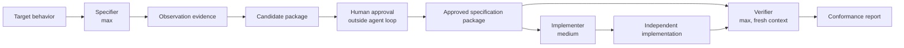

# Clean Room Plugin

`clean-room` coordinates compatibility implementation across an explicit information barrier. One
agent observes the target and drafts a behavioral specification, a human approves the package outside
the agent loop, a fresh agent implements from only that package, and another fresh agent verifies the
result against the specification.

This workflow helps preserve process discipline and an audit trail. It does not establish that a
particular reverse-engineering activity is lawful, and agent separation is not a substitute for legal
review or operating-system-level access controls.

## Workflow



The OpenCode agents all use `opencode-go/gpt-5.6-luna`, the GPT model currently available through
OpenCode Go. Model effort is selected with OpenCode variants rather than different model families:

| Agent | Variant | Purpose |
| ----- | ------- | ------- |
| `clean-room-orchestrator` | `high` | Maintain the phase boundary and coordinate handoffs |
| `clean-room-specifier` | `max` | Turn observations into a precise specification package |
| `clean-room-implementer` | `medium` | Implement only the approved behavior |
| `clean-room-verifier` | `max` | Review conformance from a fresh context |

## Isolation model

Use two directories that are not nested inside one another:

```text
observation-root/
└── .clean-room/
    ├── boundary.md
    ├── candidate/
    ├── evidence/
    └── approved/

implementation-root/
├── .clean-room/
│   ├── approved/   # reviewed copy; no observation logs
│   └── reports/
└── ... independent implementation ...
```

Place the observable target inside `observation-root`; the specifier cannot access external directories.
The implementer must run with `implementation-root` as its OpenCode working directory. Do not place
the target source, decompiler output, observation transcript, or observation worktree below that
directory. OpenCode denies the implementer access to external directories, but its permission model is
not a security sandbox; use separate OS users, containers, or machines where the information barrier
must be independently enforceable.

See [`references/artifact-contract.md`](skills/clean-room-implementation/references/artifact-contract.md)
for the handoff format.

## Install

Codex:

```sh
codex plugin marketplace add ttak0422/track-lab
codex plugin add clean-room@track-lab
```

OpenCode:

```sh
scripts/sync-opencode-skills.sh
```

Restart OpenCode after installation. Select `clean-room-orchestrator` as the primary agent, or load
`clean-room-implementation` from an existing primary agent. Invoke a phase agent directly only when the
current working directory is already that phase's isolated root.

For the strongest available separation, start each phase as a new process and never use `--continue`:

```sh
opencode run --interactive --dir /path/to/observation-root --agent clean-room-specifier \
  "Create a candidate specification package under .clean-room/candidate."

opencode run --interactive --dir /path/to/implementation-root --agent clean-room-implementer \
  "Implement the package in .clean-room/approved."

opencode run --interactive --dir /path/to/implementation-root --agent clean-room-verifier \
  "Verify the implementation against .clean-room/approved."
```

`--interactive` is required because non-interactive `opencode run` rejects `ask` permissions instead of
displaying a prompt. Do not add `--auto` when approvals are part of the information barrier.

## Layout

```text
plugins/clean-room/
├── .codex-plugin/plugin.json
├── agents/opencode/
│   ├── clean-room-implementer.md
│   ├── clean-room-orchestrator.md
│   ├── clean-room-specifier.md
│   └── clean-room-verifier.md
└── skills/clean-room-implementation/
    ├── SKILL.md
    ├── agents/openai.yaml
    └── references/artifact-contract.md
```
