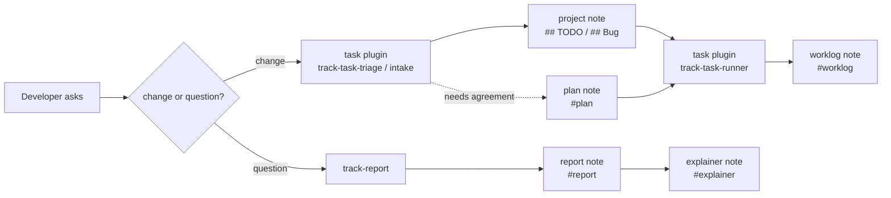

# Note Plugin

`note` treats a track vault as the **shared record between the developer and the agent**: what was
decided, what was found out, and what is still outstanding. Every skill here writes or reads that
record through the `track` CLI.

Moved out of the [track](https://github.com/ttak0422/track) repository, where these skills shipped as
the `track` plugin. track itself now carries only the CLI and its tool-neutral contract
(`docs/spec/agent-workflows.md`); the agent-facing skills live and evolve here.

## Skills

| Skill | Purpose |
| ----- | ------- |
| [track-create-note](skills/track-create-note/SKILL.md) | Create or open notes, journals, and template-backed notes — with links to drawing and embed references when the body needs them. |
| [track-search-notes](skills/track-search-notes/SKILL.md) | Read-only discovery: search by title/body/tag, resolve links, export bodies, inspect backlinks and the local graph. |
| [track-report](skills/track-report/SKILL.md) | File the findings of an investigation as a **report note**, so the answer survives the session. |
| [track-explainer](skills/track-explainer/SKILL.md) | Fold a topic's reports into one **explainer note** — the page a human actually opens, with a diagram and routes down into the reports and their sources. |
| [track-news-analysis](skills/track-news-analysis/SKILL.md) | Research a current-events topic from multiple lenses (sweep, verify, and gap-fill; an optional Workflow script is bundled) and file a visualized, source-cited **analysis note**. |
| [track-watch](skills/track-watch/SKILL.md) | Run a recurring watch loop over a topic at three depths — `light` daily brief, `mid` weekly review, `high` deep review (assumption excavation, break scenarios, falsifiable forecasts) — with a standing **watch note** as the loop state. |
| [track](skills/track/SKILL.md) | Vault maintenance: rename with backlink rewrite, doctor, reindex, generations, task toggles. |
| [track-markdown](skills/track-markdown/SKILL.md) | The body syntax itself: wikilinks and level-based heading anchors, block anchors, transclusion, GitHub alerts, task lines, inline properties, and the `track fmt` house style. |
| [track-clip](skills/track-clip/SKILL.md) | Read web pages with `track-fetch-web` or local PDFs with Xberg, and retain source versions when saving a clip. |
| [track-tool](skills/track-tool/SKILL.md) | Write a small single-file HTML tool for a note to embed: what survives the sandboxed iframe, and the one stylesheet that keeps a vault's tools looking like one set. |
| [track-japanese-report-readability](skills/track-japanese-report-readability/SKILL.md) | Keep a Japanese report readable while it stays detailed: conclusion-first layers, a density gradient, and a deletion pass over the writing an agent produced. |
| [track-japanese-tech-writing](skills/track-japanese-tech-writing/SKILL.md) | Sentence-and-paragraph craft for Japanese technical prose: formatting, argument rigor, reader load, and a ban on LLM filler. The base layer under every writing skill here. |
| [track-cognitive-rhythm-writing](skills/track-cognitive-rhythm-writing/SKILL.md) | Pacing for pages humans read start to finish: cognitive-mode switches, open tension, sentence beats, and the topic test for pruning filler. Applied to explainers. |
| [track-service-integration](skills/track-service-integration/SKILL.md) | The shared norm for skills that read and write a token-authenticated external service: treat returned data as untrusted reference, retry an unconfirmed write once under an idempotency key, and resolve the CLI through a ladder with no silent fall-through. |

## The record



Task handling (`track-task-triage`, `track-project-intake`, `track-task-runner`) lives in the
`task` plugin and runs against the same project note. Install both plugins for the full loop.

Four note kinds carry a tag so they stay findable: `plan`, `worklog`, `report`, `explainer`. Each links
back to the project note, so `track backlinks --title "<project>"` shows the whole trail.

The last arrow runs the other way from the rest. `plan`, `worklog` and `report` accumulate — one per
piece of work. An `explainer` is one per *topic*, rebuilt from the reports underneath it, and it is the
only one of the four written to be read rather than to be found. Reports optimise for coverage;
the explainer optimises for how fast someone understands the topic, which means it is mostly a
subtraction from what the reports hold.

`track-japanese-report-readability` is the odd one out: it touches no vault and runs no CLI. It governs the
prose an agent puts *into* those notes. A report nobody rereads is as lost as one nobody can find, and
the failure mode of an agent-written Japanese report is not missing detail — it is uniform detail with
no gradient, which costs the reader the same effort on the conclusion as on a footnote.

## Imported from obsidian-skills

`track-markdown` and `track-clip` are adapted from
[obsidian-skills](https://github.com/kepano/obsidian-skills) by Steph Ango (MIT) — the same strategy,
re-aimed at track primitives. `obsidian-markdown` became `track-markdown`, rewritten to describe track's
own dialect only — no frontmatter (metadata is a sidecar plus inline `key:: value` fields), GitHub
alerts, heading anchors that count `#` for the level. `defuddle` became `track-clip`, but the engine is
track's own `track-fetch-web` rather than a Node CLI. Local PDF extraction additionally uses Xberg and a Python standard-library wrapper, packaged together with Nix.

The skills themselves never mention Obsidian: an agent writing track notes has no use for what the
syntax used to be, so that context lives here in the README instead.

| obsidian-skills skill | Disposition |
| --------------------- | ----------- |
| `obsidian-markdown` | → `track-markdown` |
| `defuddle` | → `track-clip`, on `track-fetch-web` |
| `obsidian-cli` | Not imported — `track` and `track-search-notes` already cover the CLI. |
| `json-canvas` | Not imported — track has no `.canvas` surface (nearest: mermaid/dot/mindmap fences). |
| `obsidian-bases` | Not imported — track has no `.base` surface (nearest: `track-query` blocks and viewspec charts). |

## Referenced skills

Both start from gists by [k16shikano](https://gist.github.com/k16shikano) (Unlicense); provenance
lives here instead of inside the skills.

| Skill | Source | Relationship to upstream |
| ----- | ------ | ------------------------ |
| `track-japanese-tech-writing` | <https://gist.github.com/k16shikano/fd287c3133457c4fd8f5601d34aa817d> | Adapted for track; retains local formatting rules and incorporates upstream guidance on concept order, comparisons, translation-like metaphors, and necessary repetition |
| `track-cognitive-rhythm-writing` | <https://gist.github.com/k16shikano/eb2929f13ed19c97188393d297be8432> | Forked and re-aimed at explainer notes — track surfaces, figures, and wikilink routes replace the book-chapter vocabulary; the machinery (topic test, tension ledger, leak test) is preserved |

Reviewed on 2026-09-22 against Japanese tech writing revision
[`8f2d576`](https://gist.github.com/k16shikano/fd287c3133457c4fd8f5601d34aa817d/8f2d57610a73efc97d743c9b0b0ecb1002e09fa4) (2026-09-09)
and cognitive rhythm revision
[`a3b1e26`](https://gist.github.com/k16shikano/eb2929f13ed19c97188393d297be8432/a3b1e26beced71d582e13314fb6f5b179b023c76) (2026-07-09).
Upstream removed its formatting section; track keeps its footnote, punctuation, and list-label conventions.
For reading in Neovim and other editors, prose breaks at sentence endings and, for long sentences, at meaningful clause boundaries rather than fixed widths.
Local review also preserves necessary explanations, conditions, and source links during deletion passes; unresolved questions are included only when they remain in the source material.

Division of labor: reports follow `track-japanese-tech-writing` + `track-japanese-report-readability`.
Explainers use the same sentence guidance and relevant density/deletion checks, with `track-cognitive-rhythm-writing` for pacing;
they do not inherit the report's conclusion-first, four-layer structure.
Watch and project notes are history-first and do not use the report or explainer structure.

## Requirements

- `track` CLI on `PATH`, resolving against the user's normal vault.
- `track-fetch-web` on `PATH` for `track-clip`. It ships with track as a separate binary.
- `track-extract-pdf` for local PDFs. Use this repository's Nix `extract-pdf` package to supply Xberg and Python together; see the [PDF setup](../../README.md#pdf-extraction).

## Knowledge intake checks

Clips retain source versions; reports and watch results identify the inputs they used.
The shared [intake contract](skills/track/references/knowledge-intake.md) uses existing notes and metadata when the selected CLI has no version-storage API.
This fallback requires serial writes and does not enforce immutability in the CLI.

From the repository root, run the offline checks:

```sh
node scripts/check-research-workflows.mjs
python3 scripts/check-knowledge-intake.py "$(command -v track)"
nix develop path:. --command python3 scripts/check-pdf-intake.py "$(command -v track)"
```

The first mocks Workflow responses to check retained results, failures, and limits. It does not execute live agents or web requests.
The second uses an isolated temporary vault and cache to rehearse version retention, metadata repair, citations, and period boundaries.
Its fixed search cases compare opening all matches with title-first selection capped at five notes: conflicting cache specifications, a body-only retry rule, and six capacity notes.
It reports searches, notes opened, characters fetched, and missed evidence. The capped case deliberately misses one capacity note; these fixtures do not establish recall on real research questions.
The PDF check also uses an isolated vault and requires the Nix-provided `track-pdf-engine` on `PATH`.
It rehearses extraction, immutable original and text hashes, idempotent source saves, physical-page citations, and corrected source versions.
The `pdf-extraction` flake check independently exercises Japanese text, empty physical pages, malformed PDFs, engine diagnostics, deadlines, and original retention without the track CLI.

## CLI resolution

Skills here lean on the `track` CLI — and occasionally a sidecar binary such as `track-fetch-web` or a third-party CLI like `plaud`. The CLI is the source of truth, not the skill prose. A skill that embeds a command surface the binary may not have is a skill that has already drifted. Two rules keep that boundary honest.

**Keep the skill thin at the CLI boundary.** The version-matched CLI contract lives with the binary, in the track repository's `docs/spec/agent-workflows.md`, not in these skills. A skill that needs the full command surface either points at that contract or lists only what it actually uses. For an external CLI the skill does not control — `plaud`, `yap` — stay a discovery stub: name the tool and how to check it, and defer the flag surface to the tool's own `--help`. Do not enumerate flags that can drift.

**Resolve once, prefer JSON, fail closed.** Before touching the vault, settle the executable and keep it for the whole session. Resolve the CLI once — `track` on `PATH` on a normal setup, `go run ./cmd/track` in the track source repo — and reuse that choice; the two can target different builds, so do not switch between them mid-session. Prefer machine-readable output: `track` prints one compact JSON object per command, and where a CLI offers a human/JSON split pass `--json` (`plaud files --json`). Parse that, never human prose. If the resolved executable fails, check the affected operation's saved state and report its exact error. Continue independent work. Do not fall through to another build or binary — that can silently target a different vault or build — and do not guess subcommands or flags from memory.

## Layout

```text
plugins/note/
├── .claude-plugin/plugin.json
├── .codex-plugin/plugin.json
└── skills/
    ├── track-clip/SKILL.md
    ├── track-cognitive-rhythm-writing/SKILL.md
    ├── track-create-note/SKILL.md
    ├── track-explainer/SKILL.md
    ├── track-japanese-report-readability/SKILL.md
    ├── track-japanese-tech-writing/SKILL.md
    ├── track-markdown/
    │   ├── SKILL.md
    │   └── references/{DRAWING,EMBEDS,PROPERTIES}.md
    ├── track-news-analysis/SKILL.md
    ├── track-report/SKILL.md
    ├── track-search-notes/SKILL.md
    ├── track-service-integration/SKILL.md
    ├── track-tool/SKILL.md
    ├── track-watch/
    │   ├── SKILL.md
    │   └── references/{light,mid,high}.md
    └── track/SKILL.md
```

## Install

Claude Code (local development):

```sh
claude --plugin-dir ./plugins/note
```

Claude Code (marketplace):

```sh
claude plugin marketplace add ttak0422/track-lab
claude plugin install note@track-lab
```

Codex:

```sh
codex plugin marketplace add ttak0422/track-lab
codex plugin add note@track-lab
```

OpenCode:

```sh
scripts/sync-opencode-skills.sh note
```

Links this plugin's skills into `~/.config/opencode/skills/`, where opencode discovers them
natively; add `--project` to link into the current project's `.opencode/skills/` instead.
Run it from the repository root and re-run after adding, renaming, or removing a skill —
only links owned by the synced plugins are touched.

Standalone: copy or symlink the skill directories into `.agents/skills/` for Codex,
`.claude/skills/` for Claude Code, or `.opencode/skills/` for OpenCode. Preserve sibling directory
names: skills share `track/references/runtime.md`, and writing workflows reference the writing skills.
Copying the complete `plugins/note/skills/` contents preserves those references.

If you previously installed the `track` plugin from the track repository, uninstall it first — the
skill names are the same and would otherwise collide.

## Agent execution

The same `SKILL.md` files serve Codex, Claude Code, and OpenCode. See the shared
[runtime guidance](skills/track/references/runtime.md) for shell input, vault selection, and permissions.
Relative references resolve from the skill directory, including in an installed plugin cache.
The existing `agents/openai.yaml` files provide optional UI metadata; the remaining skills are
also discoverable in Codex through their `name` and `description` ([official skill documentation](https://learn.chatgpt.com/docs/build-skills)).

OpenCode uses the same skill bodies through the sync command above; directory symlinks preserve
the shared runtime reference and sibling writing-skill references. Codex UI metadata is optional
and is not required to follow the skill instructions.

News analysis and high-depth watch reviews work with the session's web search and page retrieval.
They can run sequentially, or delegate independent research when the session permits it.
The bundled JavaScript files require the optional Workflow runtime; do not run them with Node.js
or Codex's JavaScript tool. A watch invocation performs one observation; recurring scheduling is
configured only when requested and supported by the host.

A vault outside the workspace needs write access for note mutations. For Codex CLI, start with
`codex --add-dir "/absolute/path/to/vault"` when that access is intended, or use the session's
scoped approval mechanism. Do not change the user's vault just to avoid a permission error.
