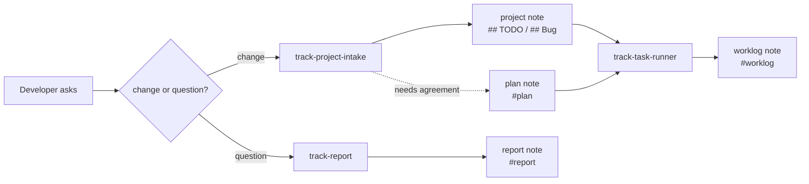

# Note Plugin

`note` treats a track vault as the **shared record between the developer and the agent**: what was
decided, what was found out, and what is still outstanding. Every skill here writes or reads that
record through the `track` CLI.

Moved out of the [track](https://github.com/ttak0422/track) repository, where these skills shipped as
the `track` plugin. track itself now carries only the CLI and its tool-neutral contract
(`docs/spec/agent-workflows.md`); the agent-facing skills live and evolve here.

## Skills

| Skill | Purpose |
| ----- | ------- |
| [track-create-note](skills/track-create-note/SKILL.md) | Create or open notes, journals, and template-backed notes — including the rich body constructs (diagrams, mindmaps, charts, queries, babel, embeds) that plain prose leaves on the table. |
| [track-search-notes](skills/track-search-notes/SKILL.md) | Read-only discovery: search by title/body/tag, resolve links, export bodies, inspect backlinks and the local graph. |
| [track-project-intake](skills/track-project-intake/SKILL.md) | Record an incoming bug/TODO against the project's note, and draft a linked **plan note** when the work needs agreement before code. |
| [track-task-runner](skills/track-task-runner/SKILL.md) | Work through a project note's checklist autonomously, following any linked plan, and move each finished item into a dated **worklog note** with its commit. |
| [track-report](skills/track-report/SKILL.md) | File the findings of an investigation as a **report note**, so the answer survives the session. |
| [track-news-analysis](skills/track-news-analysis/SKILL.md) | Research a current-events topic from multiple lenses (a bundled Workflow script sweeps, verifies, and gap-fills) and file a visualized, source-cited **analysis note**. |
| [track-watch](skills/track-watch/SKILL.md) | Run a recurring watch loop over a topic at three depths — `light` daily brief, `mid` weekly review, `high` deep review (assumption excavation, break scenarios, falsifiable forecasts) — with a standing **watch note** as the loop state. |
| [track](skills/track/SKILL.md) | Vault maintenance: rename with backlink rewrite, doctor, reindex, generations, task toggles. |
| [track-markdown](skills/track-markdown/SKILL.md) | The body syntax itself: wikilinks and level-based heading anchors, block anchors, transclusion, GitHub alerts, task lines, inline properties, and the `track fmt` house style. |
| [track-clip](skills/track-clip/SKILL.md) | Read a web page as clean Markdown with `track-fetch-web` instead of WebFetch, and save it as a `clip`-tagged note with provenance. |

## The record



Three note kinds carry a tag so they stay findable: `plan`, `worklog`, `report`. Each links back to the
project note, so `track backlinks --title "<project>"` shows the whole trail.

## Imported from obsidian-skills

`track-markdown` and `track-clip` are adapted from
[obsidian-skills](https://github.com/kepano/obsidian-skills) by Steph Ango (MIT) — the same strategy,
re-aimed at track primitives. `obsidian-markdown` became `track-markdown`, rewritten to describe track's
own dialect only — no frontmatter (metadata is a sidecar plus inline `key:: value` fields), GitHub
alerts, heading anchors that count `#` for the level. `defuddle` became `track-clip`, but the engine is
track's own `track-fetch-web` rather than a Node CLI, so the plugin adds no external dependency.

The skills themselves never mention Obsidian: an agent writing track notes has no use for what the
syntax used to be, so that context lives here in the README instead.

| obsidian-skills skill | Disposition |
| --------------------- | ----------- |
| `obsidian-markdown` | → `track-markdown` |
| `defuddle` | → `track-clip`, on `track-fetch-web` |
| `obsidian-cli` | Not imported — `track` and `track-search-notes` already cover the CLI. |
| `json-canvas` | Not imported — track has no `.canvas` surface (nearest: mermaid/dot/mindmap fences). |
| `obsidian-bases` | Not imported — track has no `.base` surface (nearest: `track-query` blocks and viewspec charts). |

## Requirements

- `track` CLI on `PATH`, resolving against the user's normal vault.
- `track-fetch-web` on `PATH` for `track-clip`. It ships with track as a separate binary.

## Layout

```text
plugins/note/
├── .claude-plugin/plugin.json
├── .codex-plugin/plugin.json
└── skills/
    ├── track/SKILL.md
    ├── track-clip/SKILL.md
    ├── track-create-note/SKILL.md
    ├── track-markdown/
    │   ├── SKILL.md
    │   └── references/{EMBEDS,PROPERTIES}.md
    ├── track-project-intake/SKILL.md
    ├── track-report/SKILL.md
    ├── track-search-notes/SKILL.md
    └── track-task-runner/SKILL.md
```

## Install

Claude Code (local development):

```sh
claude --plugin-dir ./plugins/note
```

Claude Code (marketplace):

```text
/plugin marketplace add ttak0422/track-lab
/plugin install note@track-lab
/reload-plugins
```

Codex:

```sh
codex plugin marketplace add ttak0422/track-lab
codex plugin add note@track-lab
```

Standalone: copy or symlink `plugins/note/skills/<name>` into `.claude/skills/<name>`.

If you previously installed the `track` plugin from the track repository, uninstall it first — the
skill names are the same and would otherwise collide.
