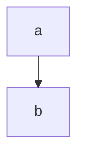

# 描画フェンス

図表や実行可能なフェンスを使うときに参照する。通常のノート作成では不要。

## フェンスの選択

ノート本文は散文だけではない。内容が構造的な場合は、段落や ASCII の図よりも、対応する構文を使うこと:

| 構文 | フェンス / 構文 | 用途 |
| --- | --- | --- |
| ダイアグラム | ` ```mermaid `, ` ```dot `, ` ```d2 ` | フロー、シーケンス、ER、状態機械。色は使わない（下記参照） |
| マインドマップ | ` ```mindmap ` | インデント付きアウトラインをマインドマップとして描画 |
| チャート | ` ```viewspec ` | ボールト内の JSONL データをプロット |
| クエリ | ` ```track-query ` | ノート上のライブなテーブル/ボード/ギャラリー/カレンダー |
| ダッシュボード | ` ```dashboard ` | 最近/ピン留めのウィジェット |
| Babel | ` ```lua :name hello :results output ` | 実行可能なコードブロック。結果はサイドカーに保持され、noweb で合成、ファイルへタングル可能 |
| 埋め込み | 単独行の `` | YouTube、Google マップ、ツイート、PDF、`assets/` メディア |

完全な構文は track リポジトリのヘルプボールト（`docs/help/note/`。Diagrams、Charts、Embeds などのノート）にあり、ヘルプサイトにも公開されている。

空の ` ```mindmap ` フェンスはノート自身の見出しツリーを描画する。`viewspec` の `data.source` はボールトの `data/` ディレクトリを基準に解決する。

## ダイアグラム

**ダイアグラムには色を書かない。** ダイアグラムフェンスは書かれたとおりにレンダラーへ渡され、読者の現在のテーマで初期化され、テーマが変わると再描画されます。そのため、色を指定しないダイアグラムはライトでもダークでも同様に判読できます。ソースに書き込まれた色はそのまま素通りし、*両方*のテーマで維持されます。つまり、どちらか一方のテーマでは、もう一方のために描かれたダイアグラムが見えることになります。暗いノードの上の暗い文字、薄いページの上の薄い線、といった具合です。`style` や `classDef` の塗り、`themeVariables` を設定する `%%{init: …}%%` ブロック、`dot` の `fillcolor`/`bgcolor` は書かないでください。区別が重要な場合は、形・ラベル・レイアウトで表現します。これらはどちらのテーマでも同じように読めます。例外は、色そのものが内容であるダイアグラム（パレット、信号機の凡例など）です。その場合は前景と背景の両方を明示的に設定し、その組だけで自己完結させます。

**ダイアグラムは縦に伸ばします。** `flowchart` は `TB` を既定にし、`LR` は3〜4ノードの短い流れに限ります。本文カラムの幅は `--measure`（既定 40em）に固定されています。それを超える図が読書面いっぱいに広がる経路はありますが、効くのは読者ビューの最上位に置かれた図だけで、編集中・入れ子の中・その他の面では効きません。そこでは横に伸びた図が幅に合わせて縮小され、ノードの文字が読めなくなります。縦に伸びる図はどの面でも同じ大きさで読め、画面が狭いほど差が開きます。`sequence` や `gantt` のように幅が要素数で決まる図は向きを変えられないので、参加者や行のほうを絞ります。

**密になったらレイアウトエンジンを替えます。** 既定の dagre は、ノードと辺が増えるほど辺の交差と空きが増えます。ELK は同じグラフをより詰めて並べるので、ノードが十数個を超えたあたりから差が出ます。mermaid では図の frontmatter で選びます。

````markdown

````

この `---` はフェンスの中にある**図自身の** frontmatter です。ノート本文の frontmatter ではありません（そちらは書きません。メタデータはサイドカーです）。

`d2` では本文の先頭で宣言します。同梱の d2 が ELK を持っているので、追加の読み込みはありません。

```d2
vars: { d2-config: { layout-engine: elk } }
a -> b -> c
```

それでも読めないなら、レイアウトではなく図が大きすぎます。節ごとに分けるか、`mindmap` に落とします。

## チャート

viewspec に書くのは**何を意味するか**であって、どう見えるかではない。色・大きさ・目盛りはテーマとレンダラーが決める。スキーマが未知フィールドを拒否するので書けるものは元から絞られているが、テーマの外へ出られる穴が1つある。`color.colors` は生の CSS 色を受け取るので、色そのものが意味を持つとき（買いと売り、合格と不合格）だけ使う。

`title` には**発見そのもの**を一文で書く。「AAPL close」ではなく「決算後に前四半期の高値を割り込んだ」である。`Jan` や `Chrome` は自分が何者か名乗るが、`26` や `0.42` は名乗らない。その名乗りを与えるのが見出しであり、測った対象と単位は `encoding.x.title` と `encoding.y[].title` が担う。自前のキャプションを持つ図では省いてよい。省いても壊れず、軸ラベルが代わりを務める。

埋め込む前に、使い捨てのコピーを通す。

```sh
track render --spec /tmp/spec.json --out /tmp/spec.html
```

成功すると `{"path": …, "records": N}` を返す。`N` が想定した件数かを見る。そのうえで確かめる。

- `data.kind` が正準の5種（`event` / `price` / `metric` / `entity` / `annotation`）のどれかである。
- `encoding` が参照する `field` がすべて実在する。kind の定義済みフィールドか、レコードが実際に持つ追加フィールドである。
- 種類に必要なチャネルが揃っている。`treemap` は `size`、`rect` は量的な `color`、`candlestick` は OHLC を含意する。
- `title` が列名ではなく結論になっている。
- 大きなデータを `data.records` に貼っていない。ファイルは `data.source` で指す。
- 合計行と内訳行が同じ系列に混ざっていない。積み上げや色分けで二重に数えられる。

