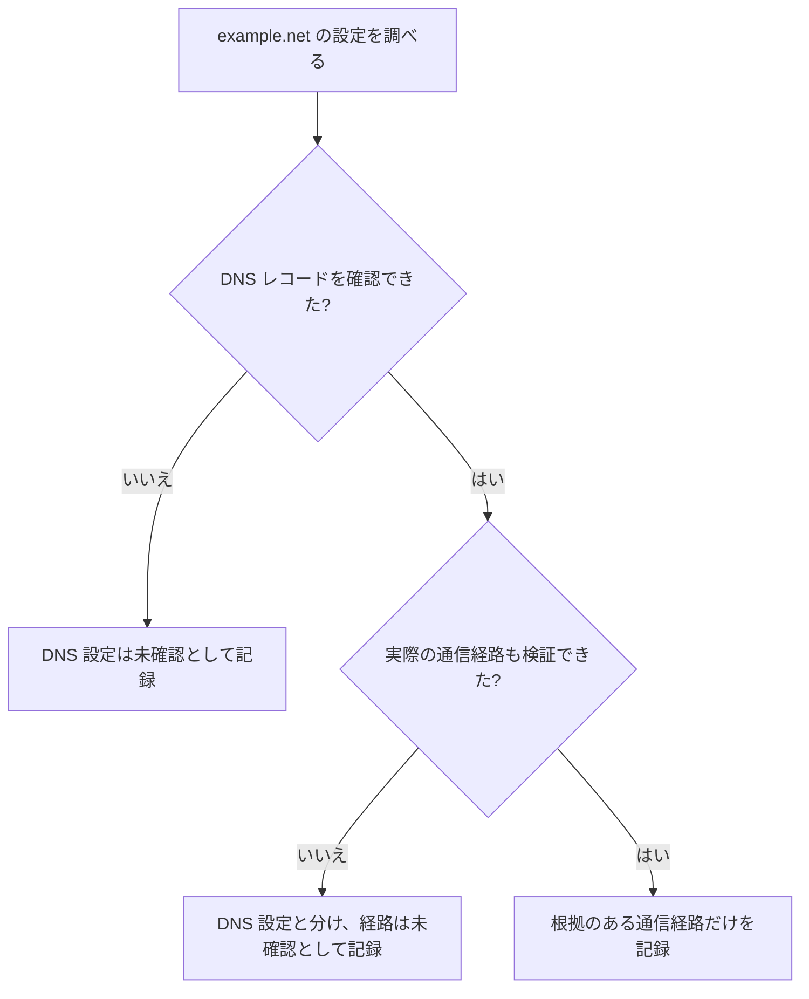
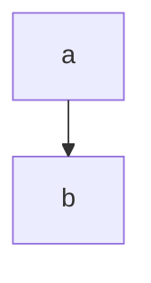

# 描画フェンス

図表や実行可能なフェンスを使うときに参照する。通常のノート作成では不要。

## フェンスの選択

ノート本文は散文だけではない。内容が構造的な場合は、段落や ASCII の図よりも、対応する構文を使うこと:

| 構文 | フェンス / 構文 | 用途 |
| --- | --- | --- |
| ダイアグラム | ` ```mermaid `, ` ```dot `, ` ```d2 ` | 構成、フロー、シーケンス、ER、状態機械。問いに合う種類と記述形式を選ぶ（下記参照） |
| マインドマップ | ` ```mindmap ` | 意味を保てる階層関係そのものを整理する。密な図の代替にはしない |
| チャート | ` ```viewspec ` | ボールト内の JSONL データをプロット |
| クエリ | ` ```track-query ` | ノート上のライブなテーブル/ボード/ギャラリー/カレンダー |
| ダッシュボード | ` ```dashboard ` | 最近/ピン留めのウィジェット |
| Babel | ` ```lua :name hello :results output ` | 実行可能なコードブロック。結果はサイドカーに保持され、noweb で合成、ファイルへタングル可能 |
| 埋め込み | 単独行の `` | YouTube、Google マップ、ツイート、PDF、`assets/` メディア |

完全な構文は track リポジトリのヘルプボールト（`docs/help/note/`。Diagrams、Charts、Embeds などのノート）にあり、ヘルプサイトにも公開されている。

空の ` ```mindmap ` フェンスはノート自身の見出しツリーを描画する。`viewspec` の `data.source` はボールトの `data/` ディレクトリを基準に解決する。

## ダイアグラムの選び方

図を描く前に、図で答える問いを定めます。図の種類と記述形式は別の選択です。

1. **問いから図の種類を選ぶ。** コンポーネントの構成、責務、配置、管理・信頼境界なら構成図（アーキテクチャ図）。処理の順序や条件分岐ならフローチャート。主体間のメッセージを時間順に示すならシーケンス図。データの関係なら ER 図、状態の遷移なら状態機械を使います。
2. **次に記述形式を選ぶ。** 構成図は `d2` を第一候補にしますが、必須ではありません。Mermaid の `flowchart` 構文でも静的な構成を描けます。使う場合は無向の辺やラベルで関係を示し、矢印を使うなら向きの意味を明記して、処理順や通信経路と誤読されないようにします。順序・分岐には Mermaid の `flowchart`、時間順のやり取りには `sequenceDiagram` を使います。
3. **レイアウトより先に意味を検証する。** 図の対象範囲と抽象度をそろえ、境界が何を囲むか（システム、配置、信頼、管理、または単なる図の範囲）を明記します。辺は通信、依存、データの流れ、DNS 設定、管理関係など、何を意味するかをラベルにします。これらは同じ関係ではありません。確認済みの事実と未確認の部分も区別し、図の囲みや線から根拠のない責務・経路を推測させないでください。
4. **意味を保ってからレイアウトを整える。** 色、狭いカラム、図の向き、密度への対応は次の節に従います。

同じドメイン名に Cloudflare Workers と iCloud+ が関係すると分かっていても、それだけでは両者が直列の通信経路だとは言えません。DNS レコードや管理主体が不明なら、関係を「同一ドメインに関するもの」と明記し、DNS 設定・管理境界・実際の通信経路は未確認として残します。実構成や経路を補ってはいけません。

次の例は、確認できている前提を「同じドメイン名が両サービスに関係する」だけに限定しています。構成図ではサービスを並列に置き、線を通信経路ではない関係として明記します。

```d2
direction: down

scope: "確認できる範囲: 同一ドメインに関する申告\n（管理境界・通信経路ではない）" {
  domain: "example.net\n同一ドメイン: 確認済み"
  workers: "Cloudflare Workers\n設定詳細: 未確認"
  icloud: "iCloud+\n設定詳細: 未確認"

  domain -- workers: "同一ドメインとの関係"
  domain -- icloud: "同一ドメインとの関係"
}

unknown: "未確認: DNS レコード / 管理主体 / 実際の通信・メール経路"
```

同じ題材でも、設定をどう調べるかという順序と分岐を示すならフローチャートです。これは実構成を表す図ではありません。


```mermaid
flowchart TB
  start["example.net の設定を調べる"] --> dns{"DNS レコードを確認できた?"}
  dns -->|いいえ| unknownDns["DNS 設定は未確認として記録"]
  dns -->|はい| route{"実際の通信経路も検証できた?"}
  route -->|いいえ| unknownRoute["DNS 設定と分け、経路は未確認として記録"]
  route -->|はい| verified["根拠のある通信経路だけを記録"]
```

`mindmap` は、元の情報の階層関係を保ったまま整理でき、階層そのものが問いへの答えになる場合に限ります。構成、通信、因果など異なる関係を単なる親子関係へ置き換えたり、密な図の避難先にしたりしないでください。

## ダイアグラムの見た目とレイアウト

**ダイアグラムには色を書かない。** ダイアグラムフェンスは書かれたとおりにレンダラーへ渡され、読者の現在のテーマで初期化され、テーマが変わると再描画されます。そのため、色を指定しないダイアグラムはライトでもダークでも同様に判読できます。ソースに書き込まれた色はそのまま素通りし、*両方*のテーマで維持されます。つまり、どちらか一方のテーマでは、もう一方のために描かれたダイアグラムが見えることになります。暗いノードの上の暗い文字、薄いページの上の薄い線、といった具合です。`style` や `classDef` の塗り、`themeVariables` を設定する `%%{init: …}%%` ブロック、`dot` の `fillcolor`/`bgcolor` は書かないでください。区別が重要な場合は、形・ラベル・レイアウトで表現します。これらはどちらのテーマでも同じように読めます。例外は、色そのものが内容であるダイアグラム（パレット、信号機の凡例など）です。その場合は前景と背景の両方を明示的に設定し、その組だけで自己完結させます。

**ダイアグラムは縦に伸ばします。** `flowchart` は `TB` を既定にし、`LR` は3〜4ノードの短い流れに限ります。本文カラムの幅は `--measure`（既定 40em）に固定されています。それを超える図が読書面いっぱいに広がる経路はありますが、効くのは読者ビューの最上位に置かれた図だけで、編集中・入れ子の中・その他の面では効きません。そこでは横に伸びた図が幅に合わせて縮小され、ノードの文字が読めなくなります。縦に伸びる図はどの面でも同じ大きさで読め、画面が狭いほど差が開きます。`sequence` や `gantt` のように幅が要素数で決まる図は向きを変えられないので、参加者や行のほうを絞ります。

**密になったらレイアウトエンジンを替えます。** 既定の dagre は、ノードと辺が増えるほど辺の交差と空きが増えます。ELK は同じグラフをより詰めて並べるので、ノードが十数個を超えたあたりから差が出ます。mermaid では図の frontmatter で選びます。

````markdown

```mermaid
---
config:
  layout: elk
---
flowchart TB
  a --> b
```
````

この `---` はフェンスの中にある**図自身の** frontmatter です。ノート本文の frontmatter ではありません（そちらは書きません。メタデータはサイドカーです）。

`d2` では本文の先頭で宣言します。同梱の d2 が ELK を持っているので、追加の読み込みはありません。

```d2
vars: { d2-config: { layout-engine: elk } }
a -> b -> c
```

それでも読めないなら、レイアウトではなく図が大きすぎます。節ごとに分けるか、問いに答える関係ごとに図を分割します。階層関係そのものが問いに合い、意味を保てる場合に限り `mindmap` を使います。

## チャート

viewspec に書くのは**何を意味するか**であって、どう見えるかではない。色・大きさ・目盛りはテーマとレンダラーが決める。スキーマが未知フィールドを拒否するので書けるものは元から絞られているが、テーマの外へ出られる穴が1つある。`color.colors` は生の CSS 色を受け取るので、色そのものが意味を持つとき（買いと売り、合格と不合格）だけ使う。

`title` には**発見そのもの**を一文で書く。「AAPL close」ではなく「決算後に前四半期の高値を割り込んだ」である。`Jan` や `Chrome` は自分が何者か名乗るが、`26` や `0.42` は名乗らない。その名乗りを与えるのが見出しであり、測った対象と単位は `encoding.x.title` と `encoding.y[].title` が担う。自前のキャプションを持つ図では省いてよい。省いても壊れず、軸ラベルが代わりを務める。

埋め込む前に、使い捨てのコピーを通す。

```sh
track render --spec /tmp/spec.json --out /tmp/spec.html
```

成功すると `{"path": …, "records": N}` を返す。`N` が想定した件数かを見る。そのうえで確かめる。

- `data.kind` が正準の5種（`event` / `price` / `metric` / `entity` / `annotation`）のどれかである。
- `encoding` が参照する `field` がすべて実在する。kind の定義済みフィールドか、レコードが実際に持つ追加フィールドである。
- 種類に必要なチャネルが揃っている。`treemap` は `size`、`rect` は量的な `color`、`candlestick` は OHLC を含意する。
- `title` が列名ではなく結論になっている。
- 大きなデータを `data.records` に貼っていない。ファイルは `data.source` で指す。
- 合計行と内訳行が同じ系列に混ざっていない。積み上げや色分けで二重に数えられる。
