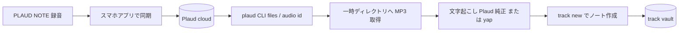

# track-plaud (experimental)

> [!CAUTION]
> この skill は実験的なドラフトです (experimental)。設計ノート「20260822 PLAUD録音をtrackへ取り込むskill設計」に基づく未検証の実装で、実際の配置先（track-lab の note プラグイン等）と CLI 契約は今後変わる可能性があります。重い実装（whisper.cpp の同梱など）は意図的に行っていません。

track CLI を使う前に `track` 本体の実行環境（`PATH` 上の `track` バイナリ、またはソースリポジトリでは `go run ./cmd/track`）が前提となる。コマンドを叩く前に、必ず [`scripts/doctor.sh`](scripts/doctor.sh) で前提チェックを行うこと。

## この skill がやること

PLAUD NOTE の録音（スマホアプリで同期済み）を、月額なし・Plaud 文字起こし枠に依存しない形で track ボールトへ取り込む。**「取り込み」に専念**し、要約・読み物化・プロジェクトへのリンク張りは既存 skill（track-report 等）に委譲する。



## 前提条件

- `track` CLI — 真実の情報源。ノート作成・検索・index を担う。
- `plaud` CLI — 公式。録音一覧取得・MP3 ダウンロード・純正文字起こし（無料枠 300 分/月）。無ければ `npm install -g @plaud-ai/cli`。
- `yap` — macOS オンデバイス ASR（macOS 26+ 必須）。無ければ `brew install finnvoor/tools/yap`。
- `curl` / `jq`。前提の詳細は [`scripts/doctor.sh`](scripts/doctor.sh) が返す。

## 手順

### 0. 前提チェック

skill 実行の冒頭で doctor を呼び、「使えるものの一覧」を得る。これが実行時確認の選択肢になる。

```sh
bash skills/track-plaud/scripts/doctor.sh
```

### 1. 取得

```sh
plaud files --json          # 録音一覧
plaud recent --days N       # 直近 N 日の録音
plaud audio <id>            # 24時間有効 URL → curl で MP3 を一時ディレクトリへ
```

デバイスの USB 接続は不要。前提はアプリ同期済みであること。

### 2. 重複判定

ノート本文に `plaud-id:: <recording id>` のインラインプロパティを書く。取り込み前に index から存在確認する（外部 state ファイルは不要。track index が真実の源）。

```sh
track search --query "plaud-id <id>"
```

ヒットすれば既に取り込み済みなのでスキップする。

### 3. 文字起こし

実行時にユーザーへ方式を尋ね、追加コストを避ける。提示順:

1. **Plaud 純正**（`plaud transcript <id>`）— 無料枠内なら追加コストゼロ・セットアップ不要。`plaud file <id>` の `transcript` フィールドで可用性を事前確認。枠超過時のみ次へ。
2. **`yap`**（macOS）— 完全オフライン・ゼロコスト。日本語の逐語性は要実測。

選択した方式は `asr:: plaud` / `asr:: yap` として記録し、次回のデフォルト提案に使う。

逐語ファースト。清書・整形はしない。

### 4. ノート化

タイトルは `YYYYMMDD HH:MM <録音名>` 形式。テンプレート:

```markdown
from [[PLAUD NOTE]]

plaud-id:: <id>
recorded:: <ISO日時>
duration:: <mm:ss>
asr:: <plaud|yap>

## Transcript

<逐語>
```

`--tag voice` を付ける。`## Summary` はオプションで agent 自身が生成する。

```sh
track new --title "YYYYMMDD HH:MM <録音名>" --tag voice < /tmp/plaud/<id>.md
```

音声ファイルは vault assets/ には入れない。必要なときだけ `track asset import` を明示的に使う。

## 設計上の決定（設計ノートより）

- LLM 工程（タイトル命名・要約）は agent 自身が担う。Ollama 等の追加基盤は不要。
- whisper.cpp の track リポジトリへの同梱は見送り（2026-08-22 決定）。C++/cgo が要るため。当面は skill 層で外部エンジンを検出して使う。
- ローカル ASR は macOS では `yap`（SpeechAnalyzer / SpeechTranscriber）を使う。`hear` / whisper.cpp / クラウド API は未想定。
- SKILL.md は agent 非依存に書き、バックエンド（plaud CLI / yap）だけに依存させる。opencode / Claude Code / Codex からの受け付けを想定。

## Open questions

設計ノートの Open questions を参照。主な未決事項:

- [ ] SKILL.md の agent 非依存化と配置先（track-lab の note プラグイン等）の確定
- [ ] Plaud 純正文字起こしを CLI 経由でトリガーできるか
- [ ] `yap` の日本語逐語性の実測
- [ ] doctor.sh の出力形式（人間向けメッセージ vs JSON）の確定
- [ ] タグ名の確定（voice / transcript / memo）
- [ ] 長時間録音（1時間超）のノート分割要否
