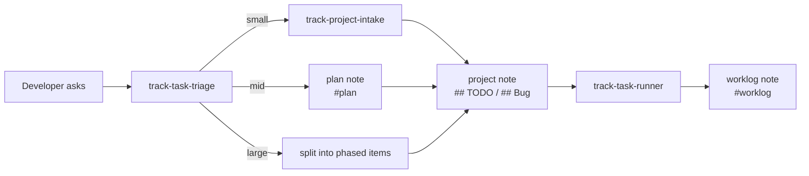

# Task Plugin

`task` は track vault 上のタスクのライフサイクルを担う。入ってきた作業をサイズで振り分け、プロジェクトノートのチェックリストに記録し、そのチェックリストを消化して日付つき worklog へ移す。CLI 操作の真実の情報源は `track` であり、このプラグインはその手順だけを定める。

`note` プラグインは共有記録のプリミティブ（ノート作成・検索・Markdown 方言・レポート・ Explainer・watch）を持ち、`task` はその上の TODO / Bug の運用を持つ。フルループで使う場合は両方を入れる。

## Skills

| Skill | Purpose |
| ----- | ------- |
| [track-task-triage](skills/track-task-triage/SKILL.md) | 依頼や既存チェックリストを S/M/L に振り分け、曖昧なものは書く前に明確化し、サイズ別の経路（直接・プランノート付き・分割）へ回す。 |
| [track-project-intake](skills/track-project-intake/SKILL.md) | 入ってきたバグ/TODO をプロジェクトノートの `## Bug` / `## TODO` に記録し、合意が必要な場合だけリンクするプランノートを下書きする。 |
| [track-task-runner](skills/track-task-runner/SKILL.md) | プロジェクトノートのチェックリストを自律的に消化し、完了項目をコミットとともに日付つき worklog ノートへ移す。 |

## The loop



## Requirements

- `track` CLI が `PATH` 上にあり、ユーザーの通常のボールトに対して解決できること。

## Layout

```text
plugins/task/
├── .claude-plugin/plugin.json
├── .codex-plugin/plugin.json
├── references/runtime.md
└── skills/
    ├── track-task-triage/SKILL.md
    ├── track-project-intake/SKILL.md
    └── track-task-runner/SKILL.md
```

個々の skill は `../../references/runtime.md` を実行環境として読む。プラグインレベルに置くのは、`skills/` 直下の全ディレクトリが配布上の skill と見なされるためである。

## Install

Claude Code (local development):

```sh
claude --plugin-dir ./plugins/task
```

Claude Code (marketplace):

```sh
claude plugin marketplace add ttak0422/track-lab
claude plugin install task@track-lab
```

Codex:

```sh
codex plugin marketplace add ttak0422/track-lab
codex plugin add task@track-lab
```

OpenCode:

```sh
scripts/sync-opencode-skills.sh task
```

Links this plugin's skills into `~/.config/opencode/skills/`, where opencode discovers them
natively; add `--project` to link into the current project's `.opencode/skills/` instead.
Run it from the repository root and re-run after adding, renaming, or removing a skill —
only links owned by the synced plugins are touched.

Standalone: copy or symlink `plugins/task/skills/<name>` into `.claude/skills/<name>` or
`.opencode/skills/<name>`, plus `plugins/task/references/runtime.md` so the
`../../references/runtime.md` link stays resolvable.
